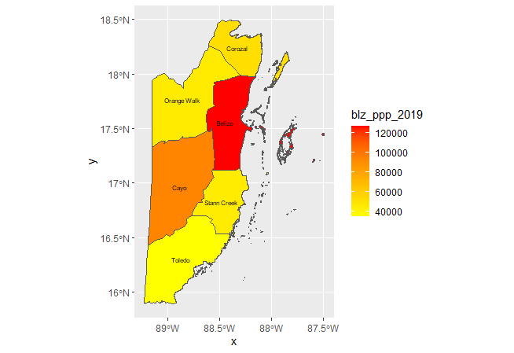
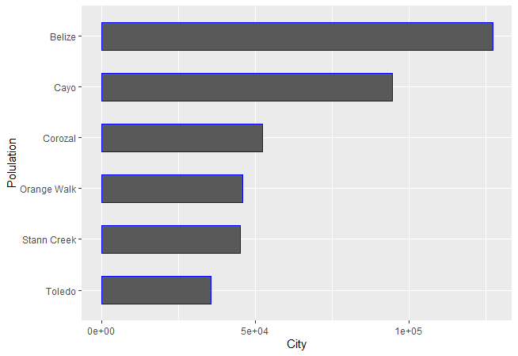
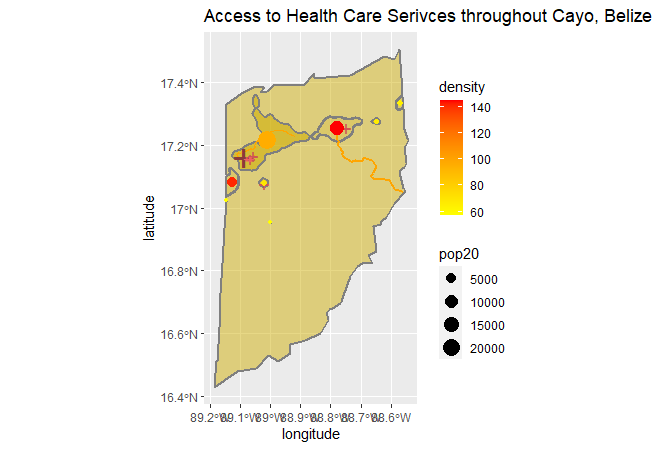

# Project_1

### Choropleth_Map
Plot 1 contains a map of Belize in 2019. This plot consists of the level one administrative subdivisions (adm1s) of Belize. 
Each subdivision is labelled and colored according to the density of its population size. 

### Geometric_Bar_Plot
Plot 2 is a barplot that indicates the share of the total population located within that subdivision. The y-axis labels each adm1 subdivision, while the x-axis represents the population size. 

### Analysis: 
Looking at these two plots led me to focus on the adm1 subdivision of Cayo. Plot 1 demonstrated that Cayo had a median-observed population, as it was the only orange color-coded subdivision. The Belize (adm1) district contained the former capital of Belize (i.e. Belize city). This area seen in Plot 1 is more coastal than that of Cayo. It is highly populated in part because of that as well as its culture, which likely attracts tourism. However, the capital was moved after a hurricaine to Balmopan which is located in the Cayo division. 

