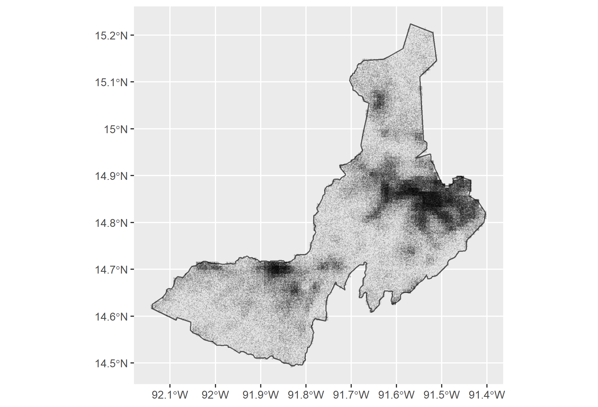
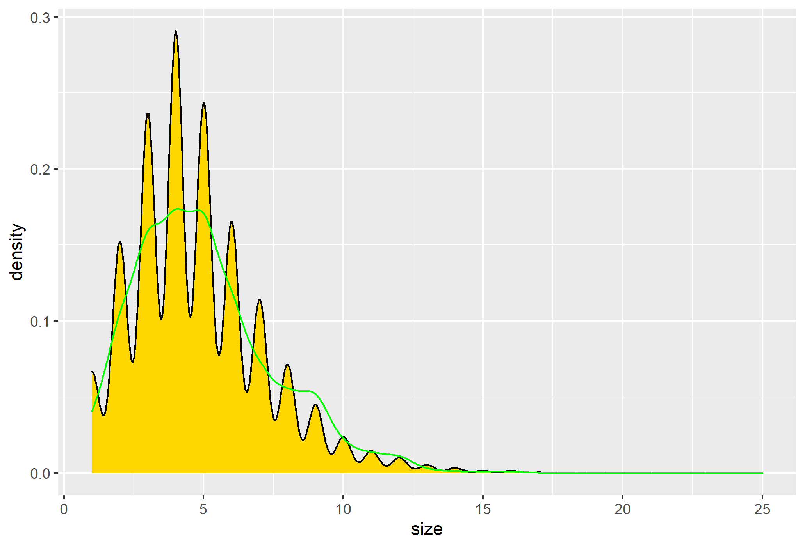
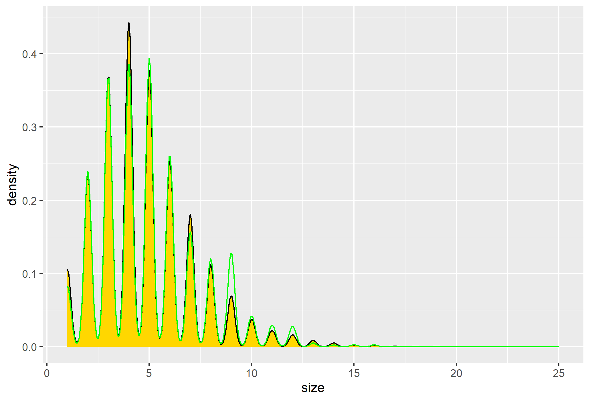

# PROJECT 2: Generating Synthetic Population of Guatemala

## DHS Data Request
I am a William & Mary student taking a Agent Based Modeling course, for which I am constructing a model of Guatemala.The motivation of this research is to improve the use of multinomial logistic regression models to produce a descriptive synthetic population by determining, approximating and validating a continuous spatial model. Preliminarily, this data will be used to produce a synthetic population of Guatemala. I will describe land use and health care demand, as well as describe movement within Guatemala using the results from this model. By using remotely sensed data to estimate the dwelling locations across Guatemala and using survey data to estimate a spatially continuous multinomial, I will accomplish this research target. The DHS data will also help me investigate the interaction of settlements, households, roads, and health care facilities as a synergetic network. 

The DHS household survey I used consisted of: 
  1) 2,598 households 
  2) 21,383 persons
  
This survey was conducted in 2014 in Guatemala. Information on each household's members was included in the survey. There were many variables, however, the ones that I isolated during my analysis were the variable weights, household size, gender, age, education level of individuals, and location. 
## Guatemala Administrative Subdivision: Quetzaltenango
I chose to pivot from households to persons at the first administrative subdivision (or adm1) level. After deciding that, I proceeded to investigate Quetzaltenango (or Quezaltenango), Guatemala. The current estimated population of Quetzaltenango is around 200,000 persons. Though, at the time that this survey was conducted (i.e. 2014) the population was about 50,000 less than that. 

## Density Plot:

## Adm1 Density Plot: 

## Raw:

Scale:

## Normal:

