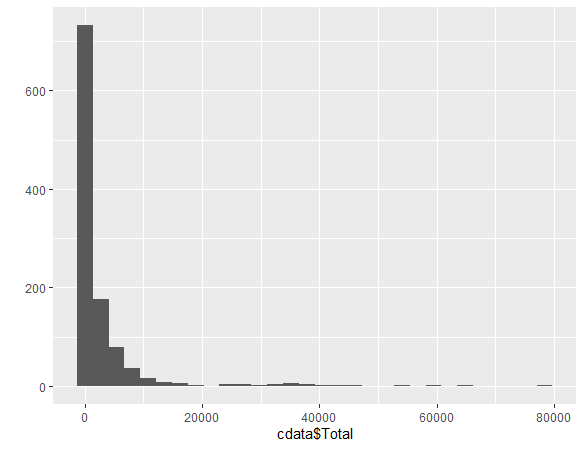
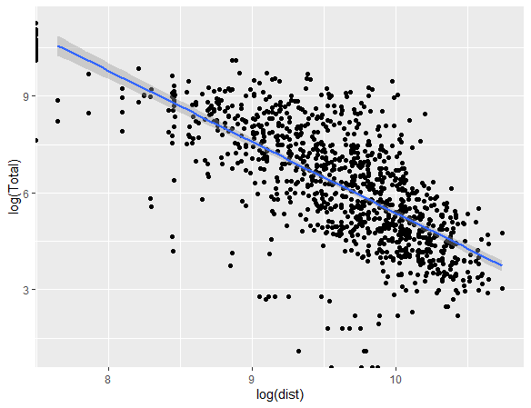
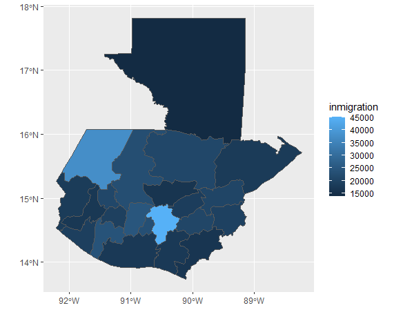
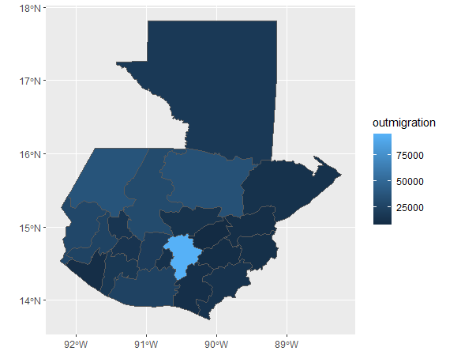
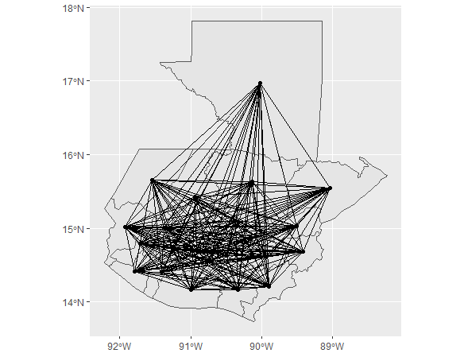
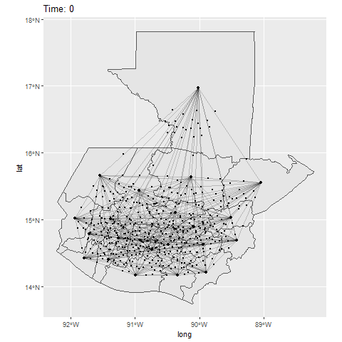

# Final Project

## Introduction to Gravity Models:
### London Gravity Model/Practice Example
To begin my introduction to gravity models I followed a practice example. "Dr Ds Guide to Spatial Interaction Modelling for Dummies - Part 1: The Unconstrained (Total Constrained) Model" was the RPubs webpage that I followed to create a gravity model. This site had the code of Adam Dennett right in it along with descriptions of what the implementation of the codiing lines would accomplish. Census data for London was used to generate estimates of commuter flows according to transportation type. As a result of updated package commands likely, I was unable to run the travel network as an animation. However, I have included the distribution of the flows within the london data and its accompanying spatial interaction model's scatter plot graph with a best fit line (after logging the distance and total). 

## Agent Based Modeling of Guatemala:
### Guatemala Gravity Model
Pursuant to my last project, I chose to generate a gravity model of Guatemala. In class, we read an article titled "Modeling internal migration flows in sub-Saharan Africa using census microdata" (Garcia et al.). Similar to the modeling outlined in this publication, my model of Guatemala will reflect an approximation of its internal migration flows. The model that I included below was produced from previously recorded migration data (i.e. from 2014). I combined the data I retrieved from WorldPop and my country's shapefiles in order to display the routes taken during travel between the states (or adm1 subdivisions) of Guatemala.  
### In/Out Migration in Guatemala

I distributed points across Guatemala with the goal of depicting a population equivalent to that of each state. The center point of each state is used as a base point for representing migration from and to other state boundaries within Guatemala. The migration plot below is modeling the movement of individual agents from each origin to its corresponding destination. Another way of distributing points might be to include population distribution data from raster data or cross comparing the population data prior to mapping for a higher accuracy in population. In places where there is less travel or migration data, making use of phone, credit card, or tourist data/rates to predict migration may be a future avenue for exploration. 

